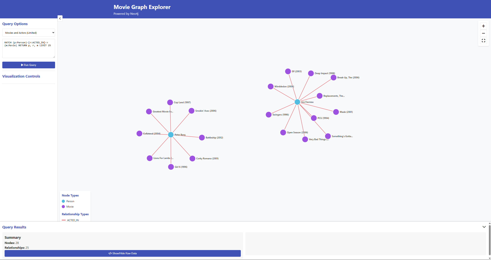
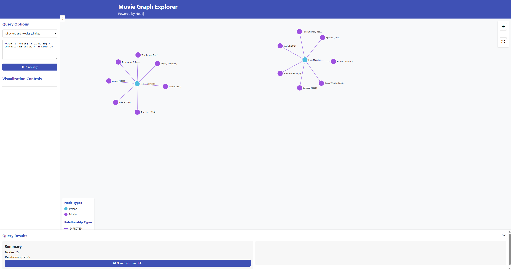
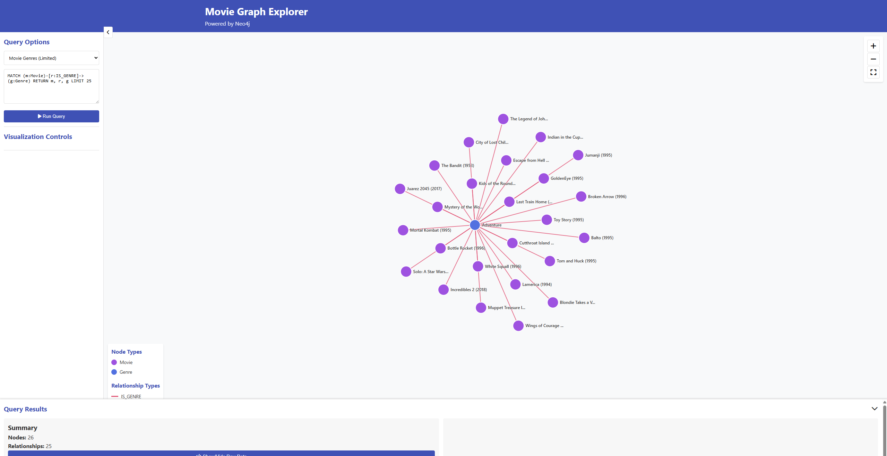
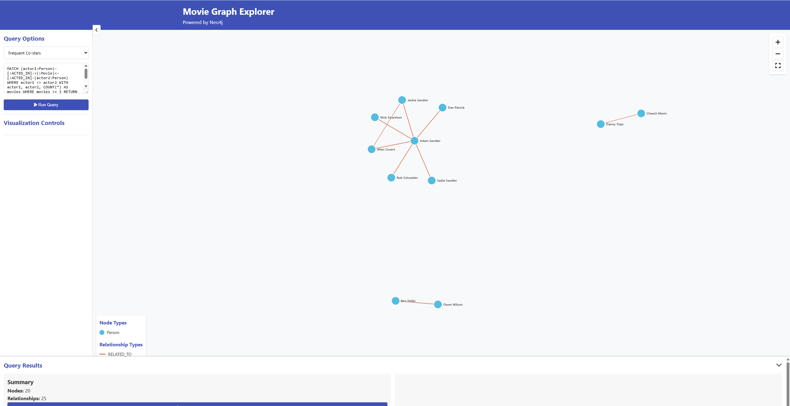
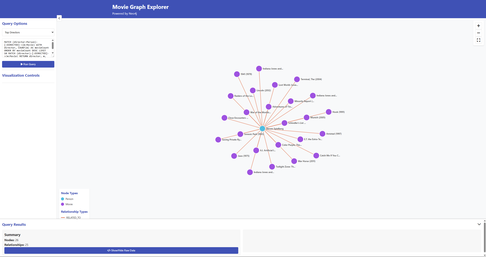

# neo4j-node-movie-db
# Neo4j Movie Database Explorer

A scalable graph database application demonstrating advanced data modeling and visualization techniques using Neo4j, Node.js, and D3.js to analyze complex relationships within the film industry.

[](https://neo4j.com/)
[](https://nodejs.org/)
[](https://d3js.org/)

## Overview

This project showcases the implementation of a high-performance graph database solution that processes and visualizes complex relationships between movies, actors, directors, and user preferences. The application demonstrates advanced data engineering practices, query optimization, and interactive visualization techniques suitable for enterprise-scale applications.

## Technical Architecture

### Database Design
- **Node Count**: 291,814 entities
- **Relationship Count**: 34,189,670 connections
- **Data Sources**: MovieLens 32M dataset integrated with TMDB Credits
- **Performance**: Optimized with strategic indexing and batch processing

### Key Components
- **Backend**: Node.js with Express.js framework
- **Database**: Neo4j graph database with Cypher query language
- **Frontend**: Interactive D3.js visualizations with responsive design
- **Data Processing**: Custom ETL pipeline for large-scale data integration

## Features

### Data Integration and Processing
- Integration of heterogeneous datasets (MovieLens and TMDB)
- Advanced data cleaning and normalization procedures
- Fuzzy matching algorithms for cross-dataset entity resolution
- Batch processing system for efficient large-scale data loading

### Query Optimization
- Custom database indexes for improved query performance
- Optimized Cypher queries for complex relationship traversal
- Memory-efficient transaction handling for large datasets

### Visualization Engine
- Interactive graph visualization with zoom, pan, and selection capabilities
- Dynamic node and edge rendering based on data properties
- Path visualization for multi-hop relationship analysis
- Responsive design with adaptive legend system

### User Interface
- Intuitive query interface with pre-built analytical queries
- Real-time graph exploration and navigation
- Detailed node and relationship information display

## Sample Analytical Queries


1. **Movies and Actors (Limited)**:
```cypher
MATCH (p:Person)-[r:ACTED_IN]->(m:Movie) RETURN p, r, m LIMIT 25
```


2. **Directors and Movies (Limited)**:
```cypher
MATCH (p:Person)-[r:DIRECTED]->(m:Movie) RETURN p, r, m LIMIT 25
```


3. **Movie Genres (Limited)**:
```cypher
MATCH (m:Movie)-[r:IS_GENRE]->(g:Genre) RETURN m, r, g LIMIT 25
```


4. **Frequent Co-stars**:
```cypher
MATCH (actor1:Person)-[:ACTED_IN]->(:Movie)<-[:ACTED_IN]-(actor2:Person) 
WHERE actor1 <> actor2 
WITH actor1, actor2, COUNT(*) AS movies 
WHERE movies >= 3 
RETURN actor1, actor2, movies 
ORDER BY movies DESC LIMIT 25
```


5. **Top Directors**:
```cypher
MATCH (director:Person)-[:DIRECTED]->(m:Movie) 
WITH director, COUNT(m) AS movieCount 
ORDER BY movieCount DESC LIMIT 10 
MATCH (director)-[:DIRECTED]->(m:Movie) 
RETURN director, m, movieCount LIMIT 25
```


## Installation and Setup

### Prerequisites
- Node.js (version 14.0 or higher)
- Neo4j Desktop or Neo4j Server (version 4.0 or higher)
- Minimum 8GB RAM recommended for dataset processing

### Configuration Steps

1. **Repository Setup**
   ```bash
   git clone https://github.com/yourusername/neo4j-movie-database.git
   cd neo4j-movie-database
   npm install
   ```

2. **Database Configuration**
   - Initialize Neo4j database instance
   - Download dataset files from the [shared repository](https://drive.google.com/drive/folders/1z57kKRe5vUeVAge5aj6OdKtlByyh6mXt?usp=sharing)
   - Place CSV files in Neo4j import directory
   - Execute data loading script from `data_script.txt`

3. **Application Configuration**
   Update database connection parameters in `index.js`:
   ```javascript
   const uri = 'bolt://localhost:7687';
   const user = 'neo4j';
   const password = 'your-secure-password';
   ```

4. **Application Launch**
   ```bash
   node index.js
   ```
   Access the application at `http://localhost:3000`

## Performance Characteristics

### Database Optimization
- **Indexing Strategy**: Comprehensive indexing on primary keys and frequently queried properties
- **Query Performance**: Sub-second response times for complex relationship queries
- **Memory Management**: Efficient handling of large result sets through pagination and batching

### Scalability Considerations
- **Horizontal Scaling**: Architecture supports Neo4j cluster deployment
- **Caching Strategy**: Implements query result caching for improved response times
- **Resource Utilization**: Optimized memory usage during data processing operations

## Technical Challenges Addressed

### Data Engineering
- **Complex Data Transformation**: Parsing nested JSON structures within CSV files
- **Entity Resolution**: Implementing fuzzy matching algorithms for cross-dataset alignment
- **Data Quality**: Comprehensive data validation and cleansing procedures

### Performance Engineering
- **Large-Scale Processing**: Efficient handling of 30+ million relationships
- **Query Optimization**: Advanced Cypher query patterns for optimal performance
- **Memory Management**: Batch processing strategies to prevent memory overflow

## Technology Stack

| Component | Technology | Purpose |
|-----------|------------|---------|
| Database | Neo4j | Graph data storage and querying |
| Backend | Node.js, Express.js | REST API and server logic |
| Frontend | D3.js, HTML5, CSS3 | Interactive data visualization |
| Data Processing | JavaScript, Cypher | ETL pipeline and query processing |

## Dataset Specifications

### MovieLens 32M Dataset
- **Records**: 32,000,204 ratings and 2,000,072 tag applications
- **Movies**: 87,585 unique films
- **Users**: 200,948 active users
- **Time Range**: January 1995 - October 2023

### TMDB Credits Dataset
- **Cast Information**: Comprehensive actor and role data
- **Crew Information**: Director and producer relationships
- **Data Format**: Processed from nested JSON structures

## Future Enhancements

- Implementation of machine learning algorithms for recommendation systems
- Real-time data streaming capabilities
- Advanced analytics dashboard with statistical insights
- RESTful API development for external integrations

## Contributing

Contributions are welcome through pull requests. Please ensure all code follows established patterns and includes appropriate documentation.

## License

This project is distributed under the MIT License. See `LICENSE` file for complete terms.

## Acknowledgments

- **GroupLens Research** for providing the MovieLens dataset
- **The Movie Database (TMDB)** for comprehensive film industry data
- **Neo4j Community** for extensive documentation and support resources
